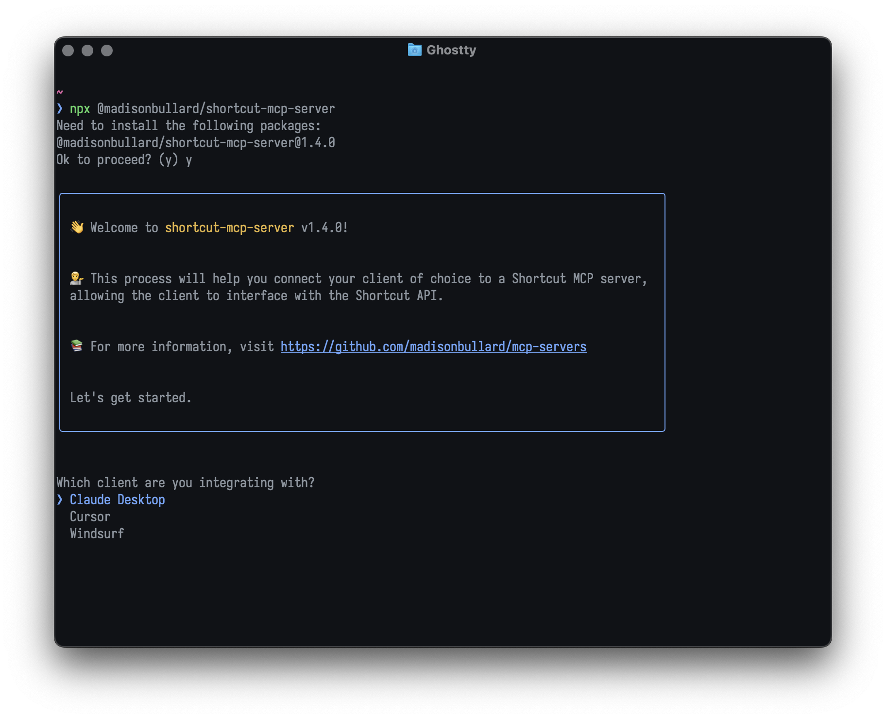

# @madisonbullard/mcp-server-tui
A TUI to install MCP servers on popular clients.

Here is an example the TUI in action, used to install [`@madisonbullard/shortcut-mcp-server`](./packages/shortcut-mcp-server/README.md):



## Supported clients
- [Claude Desktop](https://claude.ai/download)
- [Cursor](https://cursor.sh/)
- [Windsurf](https://codeium.com/windsurf)

Please feel free to add PRs for wider support!

## Usage
`npm install @madisonbullard/mcp-server-tui`

```ts
import { fileURLToPath } from "node:url";
import { cli } from '@madisonbullard/mcp-server-tui'
import { name, version } from "../package.json";

cli({
	/**
	 * The name of the package housing your mcp server (You could import this from package.json "name" property)
	 */
	packageName: name,
	/**
	 * The name by which to identify your MCP server to the client
	 */
	serviceNameHumanReadable: "Shortcut",
	/**
	 * The namespace of your MCP server for reference by the client
	 */
	mcpServerName: "shortcut",
	/**
	 * The version of your MCP server
	 */
	version,
	/**
	 * A link to more information about your MCP server
	 */
	moreInfoLink: "https://github.com/madisonbullard/mcp-servers",
	/**
	 * The config for running your server
	 */
	execConfig: {
		/**
		 * This package will resolve the user's absolute path to the module referenced here, using `which()`.
		 * e.g. "node" will resolve to `/user/path/to/node`
		 */
		command: "node",
		/**
		 * The script to execute, and any additional arguments passed to the script.
		 * The file path should reference a `.js` file even if you're writing TS source.
		 */
		args: [fileURLToPath(new URL("./path/to/mcp/server.js", import.meta.url))],
		/**
		 * An optional config for any environment variables to prompt the user for. A list of { label: string; value: string };
		 */
		env: [
			{
				/**
				 * Shortcut API token
				 */
				label: "Shortcut API token",
				value: "SHORTCUT_API_TOKEN",
			},
		],
	},
});
```

### Publishing your MCP server
- See `@madisonbullard/shortcut-mcp-server`'s [`package.json`](./packages/shortcut-mcp-server/package.json) and [`tsconfig.json`](./packages/shortcut-mcp-server/tsconfig.json) for examples to mimic in order to successfully publish to npm or your package manager of choice.
- `bun run build` or npm/Yarn/pnpm equivalent
- `bun publish --access public` or npm/Yarn/pnpm equivalent

## Development
- Pull down this repo
- `bun install`
- `bun run build` will create a `dist` folder containing `cli.js`, which can be used as described above.
